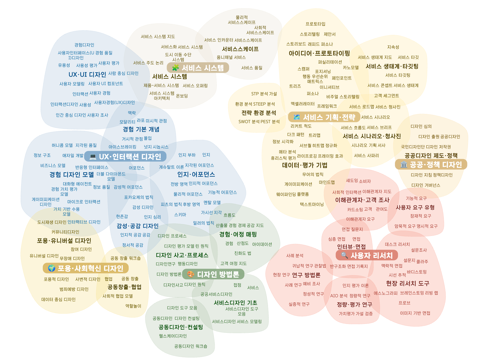

# AffinityBubble Pipeline Distribution

This repository contains the latest build of the AffinityBubble pipeline and visualization libraries.

## Bundles

| Bundle | Description | Docs |
|--------|-------------|------|
| [affinitybubble.bundle.js](./affinitybubble.bundle.js) | 전체 파이프라인 (분석 + 시각화) | — |
| [affinitybubble-input.bundle.js](./affinitybubble-input.bundle.js) | 파일 입력 모듈만 (경량) | — |
| [dist/wordmap-force.bundle.js](./dist/wordmap-force.bundle.js) | 계층형 force-directed 워드맵 (sentiment 색 모드 포함) | [docs/wordmap-force.md](./docs/wordmap-force.md) |
| [dist/bubble-compare.bundle.js](./dist/bubble-compare.bundle.js) | 두 시점 어피니티버블 비교 | — |
| [dist/timeline-cloud.bundle.js](./dist/timeline-cloud.bundle.js) | 시계열 키워드 클라우드 | — |
| [dist/sankey-chart.bundle.js](./dist/sankey-chart.bundle.js) | 산키 차트 | — |
| [dist/file-input-v3.bundle.js](./dist/file-input-v3.bundle.js) | v3 파일 입력 | — |

## Usage in Observable

```javascript
// 전체 파이프라인
import { AffinityBubblePipeline, DataInput } from "https://raw.githack.com/pxd-uxtech/affinitybubble-dist/{COMMIT_HASH}/affinitybubble.bundle.js"

// 파일 입력만
import { DataInput } from "https://raw.githack.com/pxd-uxtech/affinitybubble-dist/{COMMIT_HASH}/affinitybubble-input.bundle.js"
```

## Wordmap-Force (Vanilla JS)



D3 v7 기반 force-directed 워드맵. 옵션 / 데이터 형식 / 알고리즘은 [docs/wordmap-force.md](./docs/wordmap-force.md) 참조.

```html
<script src="https://d3js.org/d3.v7.min.js"></script>
<script type="module">
  import { createWordmapForce } from
    "https://cdn.jsdelivr.net/gh/pxd-uxtech/affinitybubble-dist@{COMMIT_HASH}/dist/wordmap-force.bundle.js";

  createWordmapForce(document.getElementById('chart'), data, {
    d3,
    // (옵션 A) 긍부정 색 모드
    sentiment: {
      domain: [1, 3, 5],
      range: ['#f69f8f', '#ffe9a9', '#88CD8B'],
      scoreFallback: 3,
    },
    extras: {
      scores: { c1: { /* label: score */ }, c2: { /* bigLabel: score */ } },

      // (옵션 B) 커스텀 색 — sentiment·팔레트보다 우선
      // 객체 또는 (label, idx) => color 함수
      colors: {
        c1: { '한강 인프라': '#3b82f6', '복잡한 삭막함': '#ef4444' },
        c2: (label, cj) => myBrand[label] ?? null,  // null이면 다음 우선순위로 fallback
      },
    },
  });
</script>
```

> CDN URL은 `@main` 대신 commit hash로 고정하세요 (jsdelivr 캐시 12시간).

- **Library Source**: [pxd-uxtech/affinitybubble-library](https://github.com/pxd-uxtech/affinitybubble-library)
- **Original Source**: [pxd-uxtech/affinitybubble-observable](https://github.com/pxd-uxtech/affinitybubble-observable)
